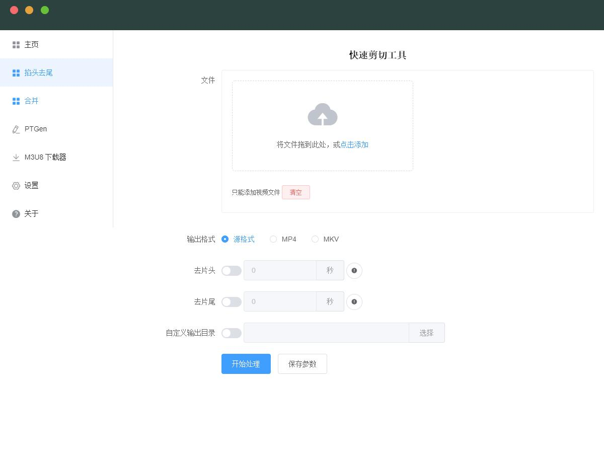
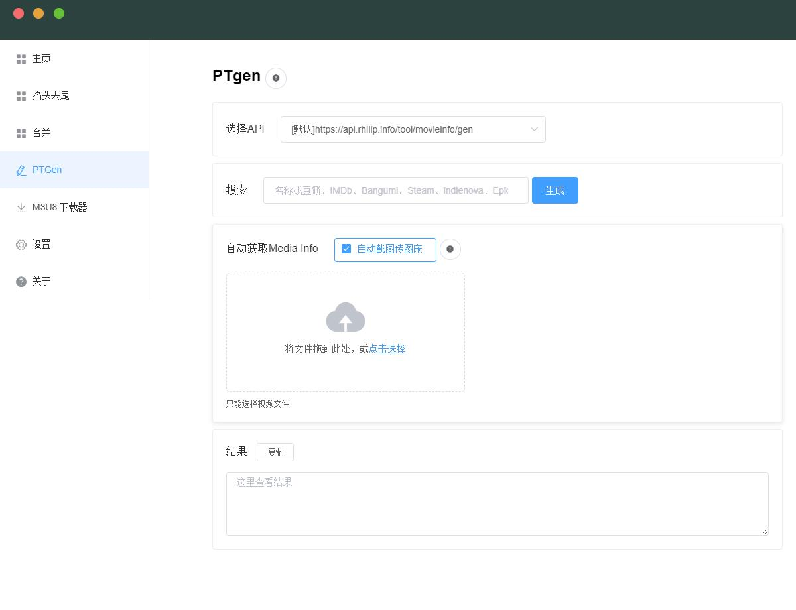
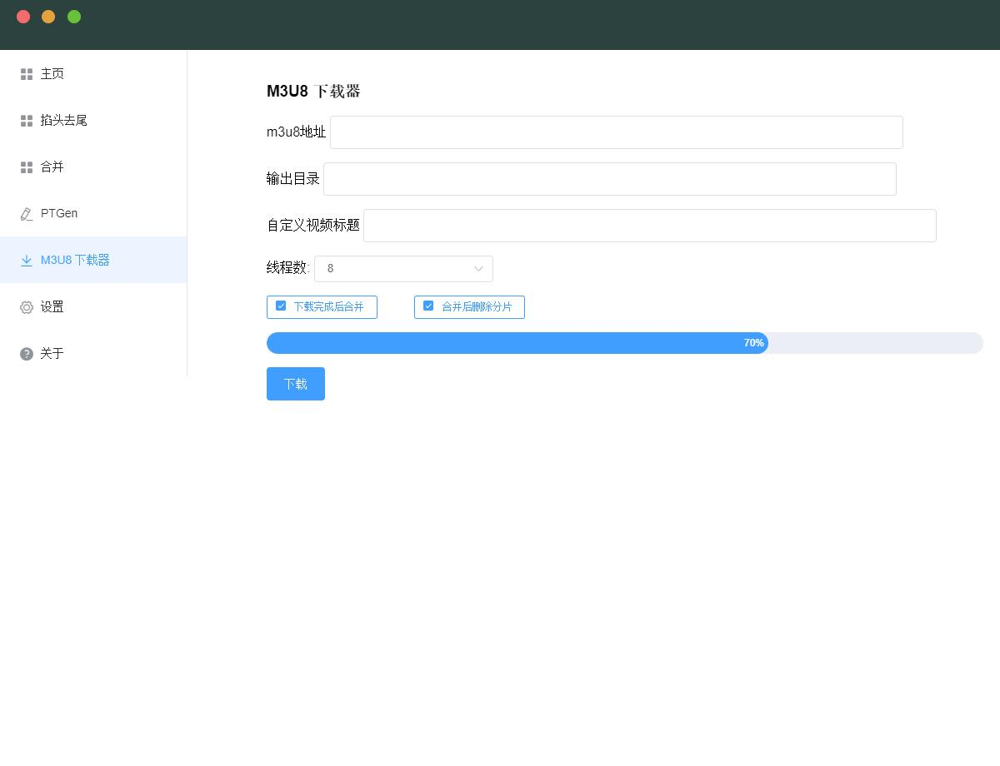

# Kiwi Box 猕猴桃工具箱

 

[](https://github.com/prettier/prettier)

包含一组PT常用工具 方便快速操作

## 下载

[点击去下载](https://github.com/plexpt/kiwibox/releases)

## 包含
视频无损剪辑

PTgen 自动生成发种所需信息

M3u8 下载器






 
## 技术选型

- electron 将前端技术应用到桌面应用的开发中，利用前端技术开发桌面应用成为可能
- vue 大大降低了前端入门门槛，让其他方向的工程师也能够快速上手
- element UI 作为vue系列中知名的组件库， 能够独立开发出美观的界面
- node 环境提供了与系统交互的能力，能够整合其他已有的工具

## 设计

- 标题栏仿照MacOS制作，在全平台上表现一致
- 美观的加载动画与通知弹窗，可以根据需要进行定制
- 使用方法尽量简单， 能够把更多的精力放在工具本身而不是GUI上

## 开发

建议是直接fork到自己的github使用，然后就可以随便玩了（？

### 安装依赖

``` bash
npm install
```

### 运行

在环境配置完毕之后，执行：

```
npm run dev
```

如果环境没有错误的话，应该可以看到app已经被正常拉起了。
 
## 依赖项目

- [Electron](https://electronjs.org)
- [Vue](https://cn.vuejs.org)
- [ElementUI](http://element.eleme.io/#/zh-CN)

## BUG与建议

欢迎issue。（也欢迎star/fork
